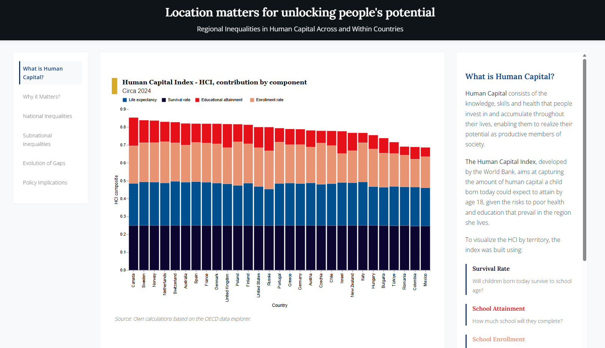

# Location matters for unlocking people's potential

Angela Lopez

## Description

This project examines regional inequalities in human capital across and within countries, using data from the OECD Regional Statistics and resources from the World Bank Human Capital Index. The analysis investigates how location, both at the national and subnational level, affects individuals' potential to accumulate human capital, measured through health outcomes (life expectancy and child survival rates) and educational achievements (tertiary attainment and school enrollment).

The visualization narrative demonstrates that while global human capital levels have improved since 2010, significant disparities persist both between countries and within them. Large subnational gaps exist even in countries with similar overall income levels, revealing that national averages can mask substantial internal inequalities. The project has the potential to inform policy discussions about place-based strategies for human capital development.

**View the live visualization:** [https://angelalop.github.io/capp30239/](https://angelalop.github.io/capp30239/)

**Note:** A screenshot of the final web visualization is embedded below. To view the complete interactive narrative locally, open `index.html` in a web browser or go to the live visualization.




## Data Sources

All visualizations are generated from real data sourced from:

1. **OECD Regional Statistics**
   - Data accessed via [OECD Data Explorer](https://data-explorer.oecd.org/)
   - Regional indicators at the TL2 level (roughly 450 subnational regions across up to 48 countries, mainly OECD members)
   - Indicators used include:
     - Life expectancy at birth
     - Child survival rates (probability of survival from birth to school age)
     - Tertiary educational attainment (adults aged 25–65)
     - School enrollment rates (youth aged 15–19)

2. **World Bank Human Capital Index (HCI)**
   - Methodology and index construction based on: World Bank. 2020. *The Human Capital Index 2020 Update: Human Capital in the Time of COVID-19*. © World Bank. Available at: http://hdl.handle.net/10986/34432 (License: CC BY 3.0 IGO)
   - The HCI was calculated following World Bank methodology, combining health and education components to measure the amount of human capital a child born today could expect to attain by age 18.

3. **World Bank GDP Data**
   - GDP per capita data (constant 2015 US$) used for correlation analysis between human capital components and economic development
   - Accessed via World Bank Open Data
   - Note: GDP data is provided as a CSV file (`data/GDP.csv`) and is not fetched programmatically

**Data Fetching:** All OECD data (education, health, and enrollment indicators) can be fetched programmatically using the `data/data_exploration.ipynb` notebook, which accesses the OECD SDMX API. The notebook includes functions to download education attainment, enrollment rates, life expectancy, and child mortality data. GDP data is the only dataset that must be obtained separately (provided as CSV in the repository).

All data citations also appear within the final HTML document (`index.html`).

## Repository Structure

```
├── README.md
├── index.html              # Final web-based visualization narrative
├── styles.css              # Styling for the web visualization
├── script.js               # Minimal JavaScript for navigation (hover effects only)
├── pyproject.toml          # Python project dependencies
├── uv.lock                 # Dependency lock file
├── data/                   # All data files
│   ├── data_exploration.ipynb  # Notebook to fetch OECD data via SDMX API
│   ├── combined_indicators_20102024.csv
│   ├── education_countries_complete.csv
│   ├── education_regional_data.csv
│   ├── enrollment_countries_complete.csv
│   ├── enrollment_regional_data.csv
│   ├── GDP.csv
│   ├── HCI_2010_2024.csv
│   ├── hci_country_year.csv
│   ├── hci_region_year.csv
│   ├── health_childmort_countries_complete.csv
│   ├── health_childmort_regional_data.csv
│   ├── health_countries_complete.csv
│   ├── health_regional_data.csv
│   └── regional_hci_all_years.csv
├── scratch/                # Experimental work 
│   └── visualizations.ipynb
├── src/                    # Code that generates all visualizations
│   └── final_visualizations.ipynb
├── graphs/                 # Generated visualization files (SVG)
│   ├── 01 Shape_hci_change_2010_2024_edited1.svg
│   ├── 02 stacked_hci_components_by_country_edited.svg
│   ├── 03 shape_health_regional_life_expectancy_variation_edited.svg
│   ├── 04 shape_health_regional_survival_rate_variation_edited.svg
│   ├── 05 shape_education_regional_attainment_variation_edited.svg
│   ├── 06 shape_education_regional_attendance_variation_edited.svg
│   ├── 07 facet_hci_gap_trends_selected_countries_edited.svg
│   ├── 08 scatter_education_attainment_vs_gdp_edited.svg
│   ├── 09 scatter_education_school_attendance_vs_gdp_edited.svg
│   ├── 10 scatter_health_child_survival_vs_gdp_edited.svg
│   └── 11 scatter_health_life_expectancy_vs_gdp_edited.svg
└── milestones/             # Project milestone documents
    ├── milestone1.md
    └── static-draft.md
```

## Generating Visualizations

All visualizations are generated from a single Jupyter notebook. The code follows the UChicago Python Style Guide with appropriate allowances for data science contexts (e.g., global variables for master datasets are used with clear commenting).

### Prerequisites

1. Install `uv` (if not already installed): https://github.com/astral-sh/uv
2. Ensure Python 3.13+ is available

### Running the Code

To generate all visualization files:

1. Install dependencies:
   ```bash
   uv sync
   ```

2. **Optional: Fetch fresh data** (if you want to update the data files):
   - The repository includes pre-processed data files in the `data/` directory
   - To fetch fresh data from OECD SDMX API, run `data/data_exploration.ipynb`:
     ```bash
     uv run jupyter notebook data/data_exploration.ipynb
     ```
   - This notebook will download and process education, health, and enrollment data
   - **Note:** GDP data (`data/GDP.csv`) must be obtained separately as it is not fetched programmatically

3. Execute the visualization notebook:
   ```bash
   uv run jupyter notebook src/final_visualizations.ipynb
   ```

   Or, if using JupyterLab:
   ```bash
   uv run jupyter lab src/final_visualizations.ipynb
   ```

4. **Important:** Execute all cells sequentially (from top to bottom) by restarting the kernel and running all cells. The notebook is designed to run sequentially and will generate all 11 SVG visualization files in the `graphs/` directory.

5. View the final narrative:
   - **Live version:** [https://angelalop.github.io/capp30239/](https://angelalop.github.io/capp30239/)
   - **Local version:** Open `index.html` in a web browser. The HTML file uses the SVG files generated by the notebook.

### Visualization Types

The project includes 11 visualizations across 4 distinct types:

1. **Ridge/Shape plots** (5 visualizations):
   - Human Capital Index change (2010-2024) with country rankings
   - Regional variation in life expectancy by country
   - Regional variation in child survival rates by country
   - Regional variation in tertiary educational attainment by country
   - Regional variation in school enrollment by country

2. **Scatter plots** (4 visualizations):
   - Education attainment vs. GDP per capita
   - School attendance vs. GDP per capita
   - Child survival vs. GDP per capita
   - Life expectancy vs. GDP per capita

3. **Stacked bar chart** (1 visualization):
   - HCI components breakdown by country

4. **Faceted line chart** (1 visualization):
   - Evolution of regional HCI gaps over time (2010-2023) for selected countries

## Visualizations Overview

The final web page (`index.html`) presents these visualizations within a goal-driven narrative organized into six sections:

1. **What is Human Capital?** - Introduces the concept and components using a stacked bar chart
2. **Why it Matters?** - Shows relationships between human capital components and GDP using four scatter plots
3. **National Inequalities** - Demonstrates country-level HCI differences using a ridge plot
4. **Subnational Inequalities** - Examines within-country variation using four regional variation charts (health and education components)
5. **Evolution of Gaps** - Tracks how regional disparities have changed over time using a faceted line chart
6. **Policy Implications** - Synthesizes findings and suggests policy directions

The narrative is designed to be readable as a printed document; the minimal interactivity (hover effects for navigation) enhances but is not required to understand the content.

## Technical Notes

- All visualizations are generated using Altair and saved as SVG files for scalability
- The web visualization uses minimal JavaScript for navigation; all content is accessible without JavaScript
- Color schemes are consistent across visualizations, using preset color mappings defined in the notebook
- Website template (`index.html`, `styles.css`, `script.js`) was developed with assistance from an AI coding assistant

