# Mapping Human Capital Territorial Inequalities in High- and Upper-Middle-Income Countries

Angela Lopez

## What is your current goal? Has it changed since the proposal?

This project aims to visualise human capital territorial inequalities within high- and upper-middle-income countries using comparable regional data. The focus is on the social outcomes that compose the World Bank Human Capital Index (education, health, and related health markers). It has not changed.

## Are there data challenges you are facing? Are you currently depending on mock data?

No — the charts I am presenting use real data from OECD territorial statistics, and the GDP data come from the World Bank. I am still working on the trend HCI (2010–2024).

## Describe each of the provided images with 2–3 sentences to give the context and how it relates to your goal.

By improving their skills, health, knowledge, and resilience (their human capital), people can be more productive, flexible, and innovative. Human capital, and each of its components (health and education), are highly correlated with productivity and wellbeing markers (see Chart 1).

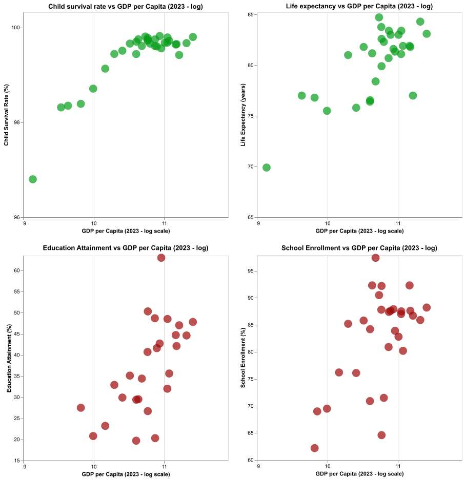

Today the world is healthier and more educated than ever, and most countries have increased their human capital levels.

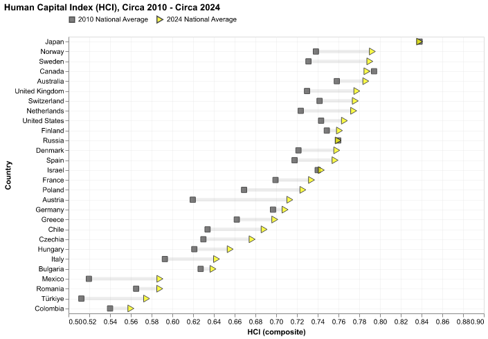

However, aggregated data hides important inequalities. For instance, education in some countries remains a challenge and is a major factor explaining the low HCI of some countries (see Chart 2).

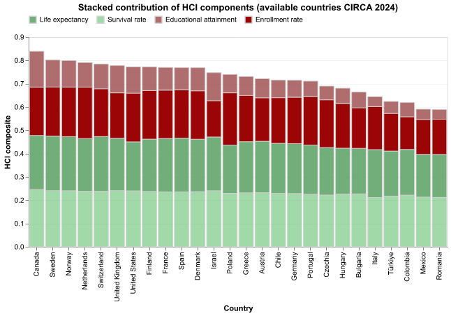

In countries such as Romania and Italy, tertiary education attainment among the population aged 25+ is much lower than in countries such as Canada. Although countries like the United States have a high overall education attainment level, regional inequalities are very large.

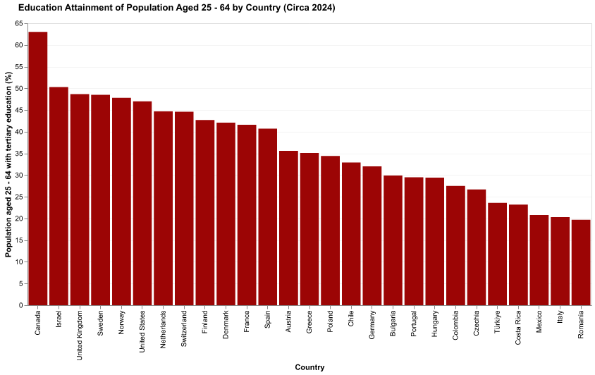
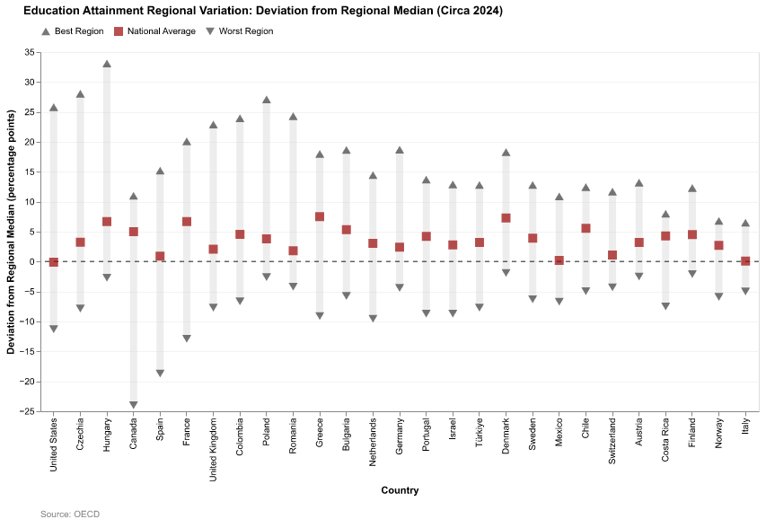

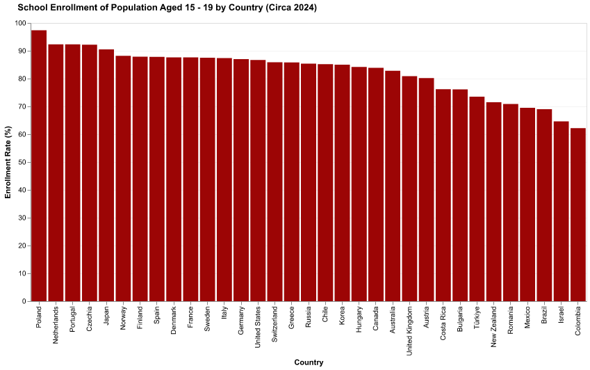
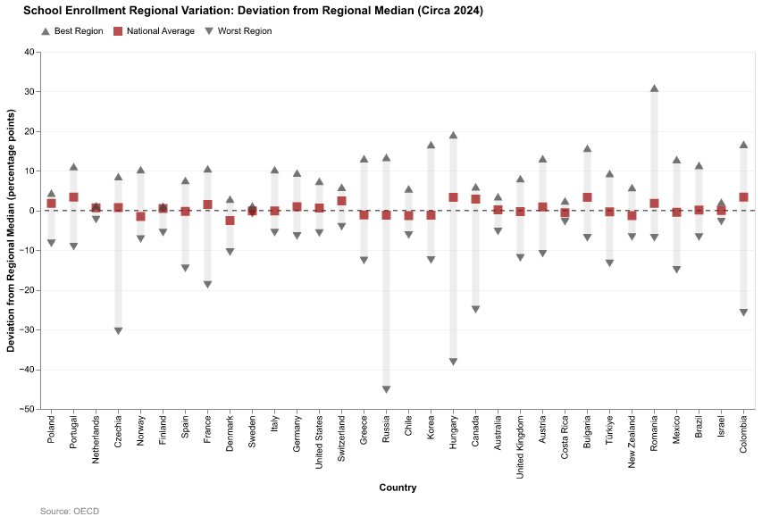

As for health, although basic health markers such as child survival are near-universal in many places, there are regions in middle-income countries (for example, Colombia or India) where child survival rates are 4.5 and 2.5 percentage points below the regional median.

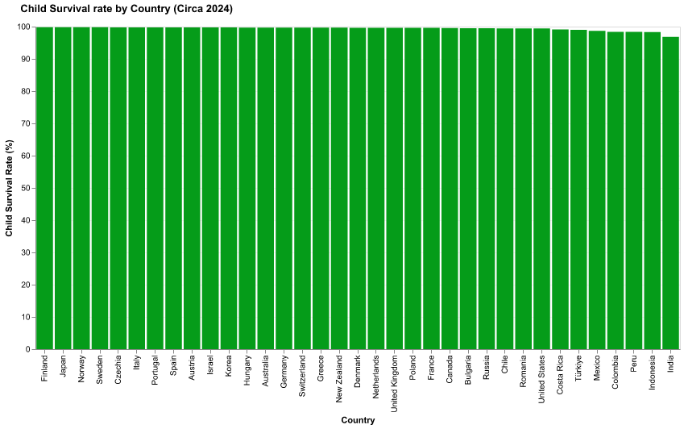
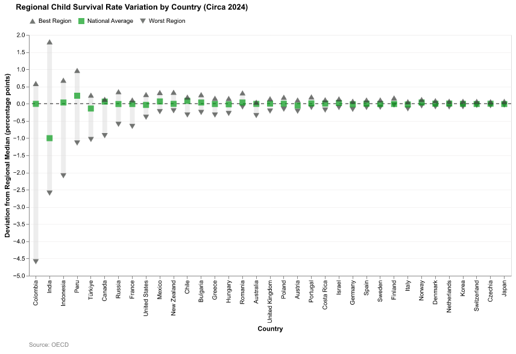

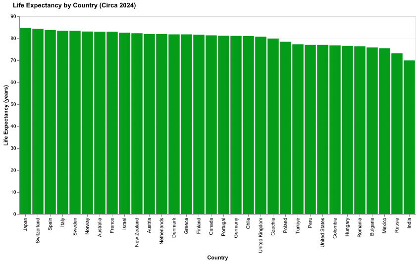
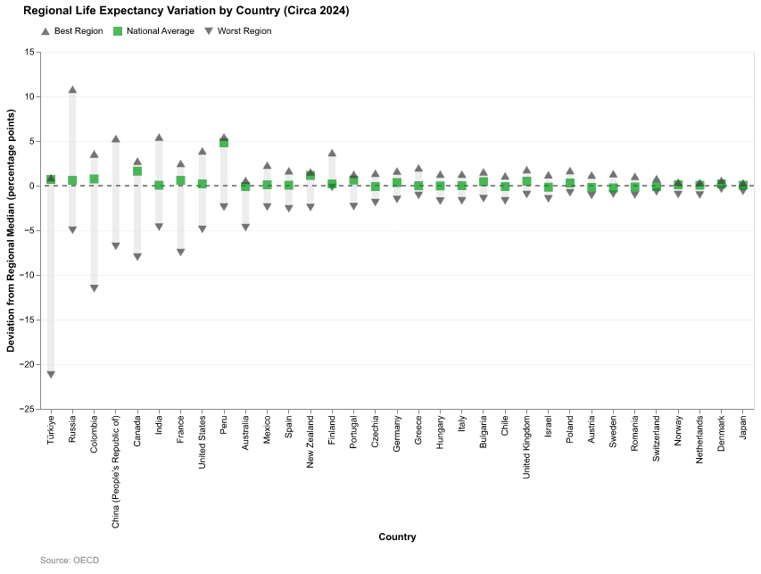

More importantly, these inequalities have increased in recent years.

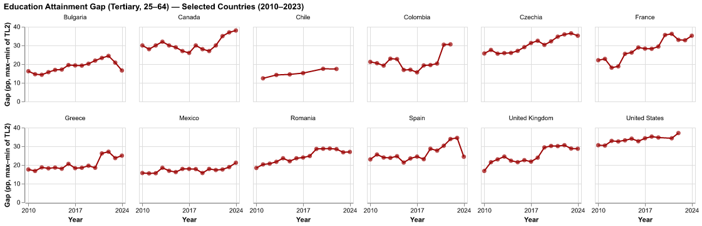

(I need to do a bit more work on the time series.)

Tip: The markdown syntax  will let you embed images directly, or you can number them and describe them by number in this file.

## What form do you envision your final narrative taking? (e.g. An article incorporating the images? A poster? An infographic?)
I think I can do an article or infographic with this information